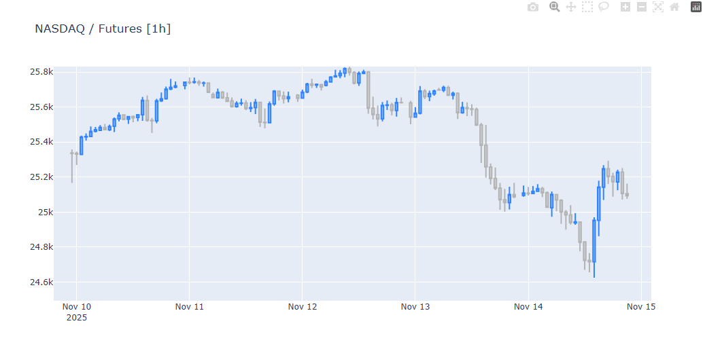

# NASDAQ.Futures_visualisation_python
Python project for downloading, cleaning and visualizing NASDAQ futures data.

## Technologies used:
- Python, Pandas
- yfinance
- Plotly
- mplfinance

## Data:
- Ticker: NQ=F
- Interval: 1h
- Period: max available

## Visualisations
- Plotly interactive candlestick chart
*(GitHub does not display Plotly charts — only static charts appear.)*
- mplfinance static candlestick chart with moving averages

## Plotly chart:

## Notes:
This is a simple exploratory mini-project created to practice financial data analysis in Python.
